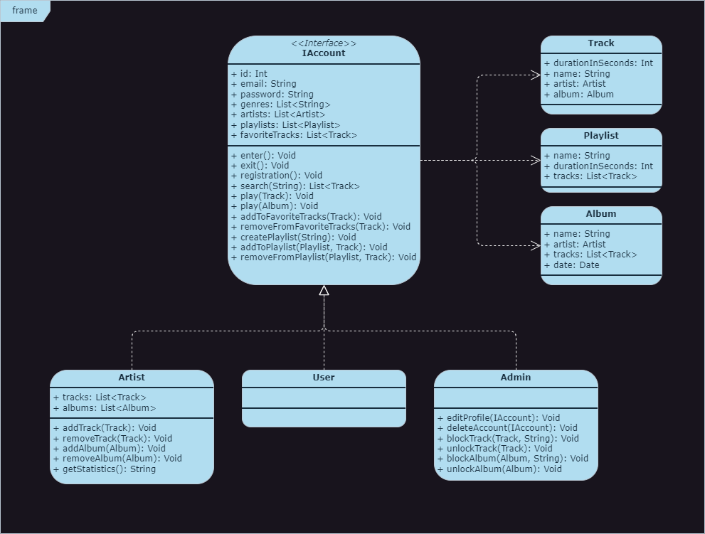

# Название проекта

Tunez

## Описание

Мобильное приложение для прослушивания музыки. Аналог Spotify.

## Функции приложения
<!-- #### 1. Регистрация и авторизация.
Пользователь может зарегистрироваться, введя адрес электронной почты и пароль, указав свои предпочтения в музыке: жанры, исполнители. Для авторизации пользователь должен ввести, указанные при регистрации адрес электронной почты и пароль.

registration(): Регистрация пользователя в приложении.
enter(): Вход пользователя в приложение.
exit(): Выход пользователя из приложения.

#### 2. Поиск треков
Пользователь может искать треки по их названию.

search(String): Выполняет поиск треков, принимая в качестве параметра название.

#### 3. Воспроизведение контента.
Пользователь может прослушивать треки, альбомы, плейлисты.

play(Track): Воспроизводит трек, принимая в качестве параметра трек.
play(Album): Воспроизводит альбом, принимая в качестве параметра альбом.

#### 4. Управление любимыми треками.
Пользователь может добавлять в свой профиль и удалять из него понравившиеся треки.

addToFavoriteTracks(Track): Добавляет в профиль понравившийся трек, принимая в качестве параметра сам трек.
removeFromFavoriteTracks(Track): Удаляет из профиля трек, который больше не нравится,  принимая в качестве параметра сам трек.

#### 5. Управление плейлистами.
Пользователь может создавать плейлисты с указанным названием, добавлять треки, удалять треки из него.

createPlaylist(String): Создает плейлист с названием, которое передается в качестве параметра.
addToPlaylist(Playlist, Track): Добавляет трек в плейлист, трек и плейлист передаются в качетсве параметра.
removeFromPlaylist(Playlist, Track): Удаляет трек из плейлиста, трек и плейлист передаются в качестве параметра.

#### 6. Возможности исполнителя
Исполнитель может выполнять те же действия, что и обычный пользователь.
Исполнитель может загружать в приложение свой контент(треки, альбомы), который могут прослушивать остальные пользователи, получать статистику по своему контенту.

addTrack(Track): Добавляет трек в профиль исполнителя, принимая в качестве параметра трек.
removeTrack(Track): Удаляет трек из профиля исполнителя, принимая в качестве парамтра трек.
addAlbum(Album): Добавляет альбом в профиль исполнителя, принимая в качестве параметра альбом.
removeAlbum(Album): Удаляет альбом из профиль исполнителя, принимая в качестве параметра альбом.
getStatistics(): Возвращает статистику по прослушиваниям контента исполнителя.

#### 7. Возможности админа.
Админ может выполнять те же действия, что и обычный пользователь.
Админ может редактировать профили обычных пользователей и исполнителей, удалять их аккаунты. Админ может заблокировать треки и альбомы исполнителя, указав причину бана.
Исполнитель может исправить ошибки. После чего админ может рассмотреть новый вариант контента и если его все устраивает вернуть контент в общий доступ.

editProfile(IAccount): Редактирование профиля, который передается в качетсве параметра.
deleteAccount(IAccount): Удаление профиля, который передается в качестве параметра.
blockTrack(Track, String): Блокировка трека исполнителя, с указанием причины бана. Трек и причина передаются в качестве параметров.
unlockTrack(Track): Разблокировка трека исполнителя, трек передается в качестве параметра.
blockAlbum(Album, String): Блокировка альбома исполнителя, с указанием причины бана. Альбом и причина передаются в качестве параметров.
unlockAlbum(Album): Разблокировка альбома исполнителя, альбом передается в качестве параметра.-->

## UML
